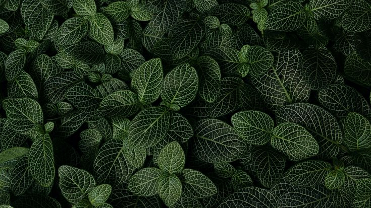

# Plant Disease Detection

A web application that detects plant diseases from leaf images using a DenseNet121 model fine-tuned on the PlantVillage dataset. Achieves **96.6% validation accuracy** across 15 disease classes covering pepper, potato, and tomato plants.

## Demo

Upload a leaf image → get a disease prediction with confidence score.



## Diseases Detected

| Plant | Class |
|-------|-------|
| Pepper | Bacterial Spot, Healthy |
| Potato | Early Blight, Late Blight, Healthy |
| Tomato | Bacterial Spot, Early Blight, Late Blight, Leaf Mold, Septoria Leaf Spot, Spider Mites, Target Spot, Yellow Leaf Curl Virus, Mosaic Virus, Healthy |

## Model

| Detail | Value |
|--------|-------|
| Architecture | DenseNet121 (ImageNet pretrained) |
| Input size | 224 × 224 × 3 |
| Classes | 15 |
| Training images | 16,516 |
| Validation images | 4,122 |
| Final val accuracy | **96.6%** |
| Final val loss | 0.0960 |

Training used a two-phase approach:
- **Phase 1** (20 epochs, LR=1e-3): DenseNet base frozen, only the classification head trained → ~95.2% val accuracy
- **Phase 2** (30 epochs, LR=1e-5): Top 50 DenseNet layers unfrozen for fine-tuning → 96.6% val accuracy

## Project Structure

```
Plant Disease Detection/
├── pdd.py                  # Flask web application
├── model.h5                # Trained model weights
├── plant-village.ipynb     # Training notebook (Kaggle)
├── requirements.txt        # Python dependencies
├── templates/
│   ├── index.html          # Upload page
│   └── predict.html        # Results page
└── static/
    ├── back.jpg            # Background image
    └── uploads/            # Temporary image uploads
```

## Setup

**1. Create and activate a virtual environment:**
```bash
python -m venv venv

# Windows
venv\Scripts\activate

# Linux/Mac
source venv/bin/activate
```

**2. Install dependencies:**
```bash
pip install -r requirements.txt
```

**3. Run the app:**
```bash
python pdd.py
```

Open `http://127.0.0.1:5000` in your browser.

## Usage

1. Click **Choose File** and select a leaf image (PNG, JPG, JPEG, or GIF)
2. Click **Submit** to upload
3. Click **Image Analysis** to run the model
4. View the predicted disease and confidence score

## Training

The model was trained on Kaggle using the [PlantVillage dataset](https://www.kaggle.com/datasets/emmarex/plantdisease) with 2× Tesla T4 GPUs. To retrain:

1. Open `plant-village.ipynb` on Kaggle
2. Attach the `emmarex/plantdisease` dataset
3. Set accelerator to **GPU T4 x2**
4. Run all cells — `model.h5` is saved to the output directory
5. Download and replace the local `model.h5`

## Requirements

- Python 3.10+
- TensorFlow 2.19+
- Flask 3.x
- See `requirements.txt` for full list
